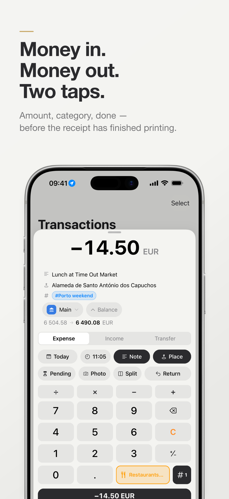
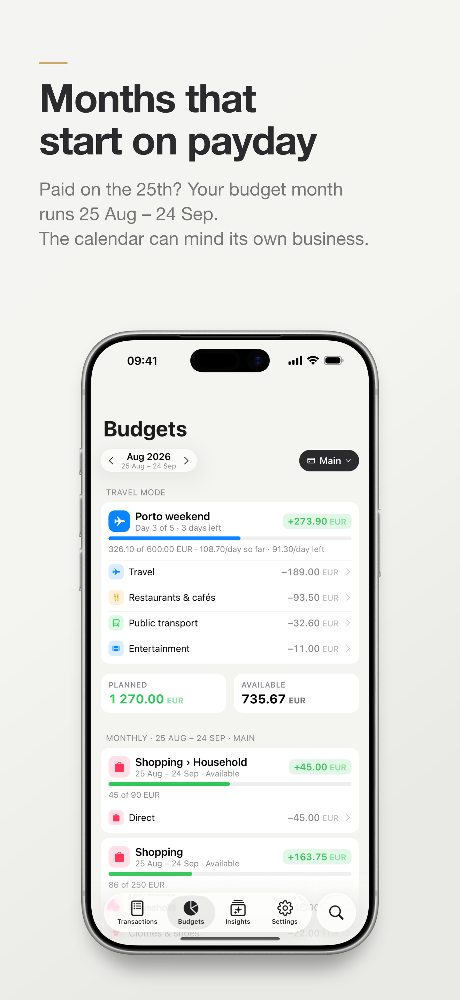
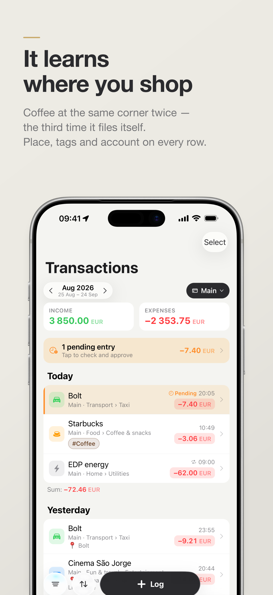
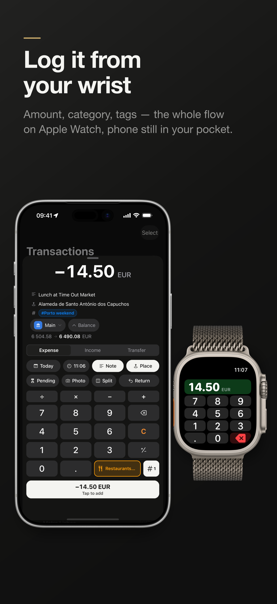
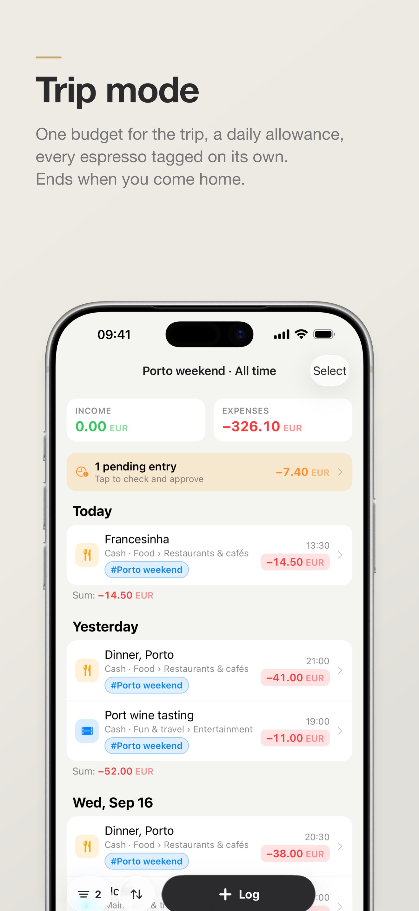

# Kopiyka Budget

**A fast, local-first budget tracker for iPhone, iPad and Apple Watch.** Log an expense in two taps,
keep every number on your own device, and get budgets that start on payday instead of the 1st.

Built with React Native (Expo) and a little Swift. Free, open source, no account, no server, no
trackers.

[](LICENSE)


<p align="center">
  
  
  
  
  
</p>

## Why this exists

Not knowing where I stood with money used to drive me mad, so more than ten years ago I started
logging every expense. The first app I used was free when I began and later became a one-time
purchase, which was fair enough. The habit stuck, but the app never gave me any real insight into
where my money was actually going.

For the last two years I used a budgeting app that cost quite a lot as a one-time purchase. The
developer had gone quiet on known bugs, and the “native” iOS app had become painfully slow: I would
wait a couple of seconds before I could type a single digit. The last straw was the Apple Watch app,
which simply stopped working. The explanation was “Apple”, while everything else on the watch worked
fine. It was not Apple.

I have worked as a React Native developer for many years, shipping apps that real people use every
day, and I had wanted for a long time to give something back to open source and fix this one
problem: a free, local app for tracking money that is actually good and pleasant to use. I finally
had the reason.

I am happy with how it turned out. The Shortcuts automation alone removes almost all of the friction
I used to have, and tags paired with categories feel so obvious that I still wonder why nobody did
it. I built this with care and I intend to keep looking after it. Your data is yours, so if I ever
get hit by a bus you can take it anywhere in a minute. I am not planning on that: I have a daughter,
Olivia, on the way, and a lot to live for.

Thank you for trying Kopiyka.

## What it does

**Logging**
- Two taps: amount on a calculator keypad, category on the key next to it, done. Tags, note, place,
  photo and a pending flag are one tap away and never in the way.
- Apple Watch app with the same flow, today's entries, your budgets, and an "Add expense"
  complication. Ultra owners can put it on the Action button.
- Siri and Shortcuts actions: add an expense, open the keypad, scan a receipt.
- Runs on iPad as well, one column down the middle of the window rather than a phone screen stretched
  across it; two of your own devices meet in the iCloud backup folder and merge.
- **Bank notifications (beta, needs iOS 27):** a Shortcuts automation hands your bank's payment notification to
  Kopiyka, which reads the amount, shop, card and time out of the text *on the device* — and, if you
  let Shortcuts pass your location, where you paid — and files the entry as pending for you to
  approve. No bank connection, no API, nothing leaves the phone.
- It learns from you: a shop you have filed before files itself, and with location on, the category
  you used near here is suggested first.

**Money**
- Several accounts in several currencies, grouped how you like; net worth in your base currency.
- Transfers between accounts, including across currencies, with exchange rates from the European
  Central Bank cached per day so old transfers keep converting correctly.
- Budgets per category, folder, tag or for everything — in a month that starts on the day you are
  paid (the 1st, the 15th, or any day you choose).
- Recurring payments: subscriptions post themselves on the day and tell you; the bills whose amount
  moves around ask first. Kopiyka also spots repeats in your history and offers to make rules.
- Trip mode: name a trip, give it a budget and a last day, and every expense is tagged and counted
  against it with a daily allowance — in whatever currency you spend.
- Debts: who owes whom, with a reminder on the due date; settling one writes the transaction.
- Insights you pick yourself: free to spend, days until salary, a savings goal, a payments checklist,
  subscriptions per year, upcoming payments, regular spending.

**Your data**
- Everything is in a SQLite file on your phone. No account, no server, no analytics, no ads.
- A full backup goes to *your own* iCloud Drive (Files → iCloud Drive → Kopiyka) every day and
  after changes; restore from any of them. Receipt photos are mirrored beside the backups.
- Export any time as JSON (everything), CSV (transactions) or a ZIP bundle with the photos in it.
- Moving from another app? Hand your old export and [this prompt](docs/migrate-with-ai.md) to an AI
  assistant and import the result.

## How it is built

```
packages/core      TypeScript, no platform code: schema + migrations, backups and import/export,
                   calculator, recurring rules, budgets, trips, debts, insights, rates, category
                   suggestion. Runs against bun:sqlite in tests and expo-sqlite on the phone.
apps/mobile        Expo SDK 57 / React Native 0.86 app (expo-router, native tabs, form sheets)
  native/          Swift compiled into the app: App Intents, WatchConnectivity bridge, the bank
                   notification parser, receipt reading, iCloud backups, the quick-log entry point
  targets/watch    SwiftUI Apple Watch app;  targets/watch-widget  the complication
  screenshots/     the App Store screenshot pipeline (one command, own simulators, demo data)
  .maestro/        end-to-end flows driven through accessibility labels
```

A few decisions that shape the code:

- **Local-first, one source of truth.** The phone's SQLite file lives in the App Group container.
  While the JavaScript app runs it owns that file; Swift never opens it and forwards writes to JS.
  Only background launches (an intent, the watch, a cold quick-log) touch SQLite from Swift.
- **Ids are the identity, merge never deletes, replace does.** Backups, restores and imports all
  follow the rules in [DATA.md](DATA.md). Read it before touching anything that writes rows.
  [docs/how-it-works.md](docs/how-it-works.md) explains backups, quick logging, the watch and trips
  in more depth.
- **Native components, custom keypad.** Native stack and tabs, iOS form sheets with detents, the
  system keyboard for text and a custom calculator keypad for amounts. Every sheet has information
  at the top and inputs in a bottom-anchored bar.
- **No blue.** The palette is the launch-screen off-white, graphite, and the category colours.

## Getting started

You need a Mac with Xcode 26 (iOS 26 and watchOS 26 simulators), [Bun](https://bun.sh), Node 20+
(Expo CLI) and CocoaPods.

```sh
bun install
bun test                              # the core package, ~150 tests

cd apps/mobile
bun run prebuild                      # generates ios/ with the watch app and complication targets
bun run ios                           # dev-client build on a simulator + Metro
```

Building for a real iPhone or uploading to TestFlight needs your Apple Developer Team ID. Put it in
`apps/mobile/.env` (copy `.env.example`); it is read by `app.config.js` and never committed.
Simulator builds work without it.

Useful commands, all from `apps/mobile`:

| Command | Does |
|---|---|
| `bun run ios:device` | build and run on a connected iPhone |
| `bun run typecheck` / `bun run lint` | TypeScript / eslint |
| `bun run screenshots` | build a Release simulator app, seed demo data, capture and frame the App Store screenshots ([details](apps/mobile/screenshots/README.md)) |
| `bun run screenshots:demo` | regenerate the demo dataset (`screenshots/demo/kopiyka-demo.json`, importable on any phone) |
| `bun run icons` | redraw every app icon asset from one vector mark (`scripts/make-icons.mjs`; needs `rsvg-convert` and ImageMagick) |
| `bun run release:ios` | bump the build number, archive, upload to TestFlight (your account, your call) |
| `maestro test .maestro` | end-to-end flows on a simulator ([details](apps/mobile/.maestro/README.md)) |

Deep links use the `kopiyka://` scheme: `log?amount=12.5&category=<id>`, `transactions`, `budgets`,
`insights`, `settings/recurring`, `pending`, and every route under `apps/mobile/src/app`.

## Website

`site/` is a small static promo page (features, screenshots, privacy policy, terms, the migration
guide) ready for GitHub Pages. `bun run site` rebuilds it from the markdown in `docs/` and the App
Store screenshots; [`site/README.md`](site/README.md) explains how to turn Pages on when the time comes.

## Privacy

Kopiyka collects nothing. There is no server to send anything to. The single network request the app
makes is the exchange-rate lookup (`api.frankfurter.dev`, ECB reference rates, two currency codes and
a date). Location, camera and notifications are optional and used only on the device. The full
[privacy policy](docs/privacy-policy.md) and [terms of use](docs/terms-of-use.md) are in `docs/`.

## Roadmap

Planned, roughly in order:

- **A local web portal** — a small page you run on your own machine (from a backup file or the
  Mac's copy of it) to browse expenses and see a few insights on a big screen. Nothing hosted.
- **Bug fixes** — always. Open an issue.
- **Home Screen widgets** — the WidgetKit target exists (`apps/mobile/targets/widget`, disabled) and
  comes back once it is reliable; the watch complication already ships.

**Android** is not planned for now, but not ruled out either. The core package is platform-agnostic and
the Expo app should get most of the way, so if you want to make it work before I get there, go ahead —
pull requests are welcome.

## Contributing

Issues and pull requests are welcome; [CONTRIBUTING.md](CONTRIBUTING.md) has the setup, the design
rules and the checks to run. Security reports: see [SECURITY.md](SECURITY.md).

## Built on

Kopiyka stands on other people's open-source work. Thank you to the people behind:

- [Expo](https://expo.dev) (SDK 57) and [expo-router](https://docs.expo.dev/router/introduction/), with
  [expo-sqlite](https://docs.expo.dev/versions/latest/sdk/sqlite/), expo-location, expo-maps, expo-camera,
  expo-image-picker, expo-notifications, expo-file-system, expo-sharing, expo-document-picker, expo-image,
  expo-haptics, expo-symbols, expo-glass-effect, expo-splash-screen, expo-build-properties and
  [@expo/ui](https://docs.expo.dev/versions/latest/sdk/ui/) for the SwiftUI pieces.
- [React Native](https://reactnative.dev) and [React](https://react.dev); react-native-screens,
  react-native-safe-area-context, react-native-gesture-handler, react-native-reanimated and
  react-native-worklets from the Software Mansion and community teams.
- [@bacons/apple-targets](https://github.com/EvanBacon/expo-apple-targets) by Evan Bacon, which is how the
  Apple Watch app and the complication live inside an Expo project.
- [fflate](https://github.com/101arrowz/fflate) (ZIP bundles) and [Papa Parse](https://www.papaparse.com)
  (CSV) in the core package.
- [Bun](https://bun.sh), [TypeScript](https://www.typescriptlang.org), [ESLint](https://eslint.org) with
  eslint-config-expo, and [marked](https://marked.js.org) for the website build.
- Exchange rates come from the [Frankfurter](https://frankfurter.dev) API, which serves European Central
  Bank reference rates without a key or an account.
- The device bezels in the screenshots are Apple's own, taken from Apple Design Resources and the
  [fastlane frameit-frames](https://github.com/fastlane/frameit-frames) mirror; the pipeline also uses
  librsvg, ImageMagick, [idb](https://fbidb.io) and [Maestro](https://maestro.mobile.dev) during development.

Licences of the dependencies are in their packages under `node_modules` after `bun install`.

## License

[MIT](LICENSE).
